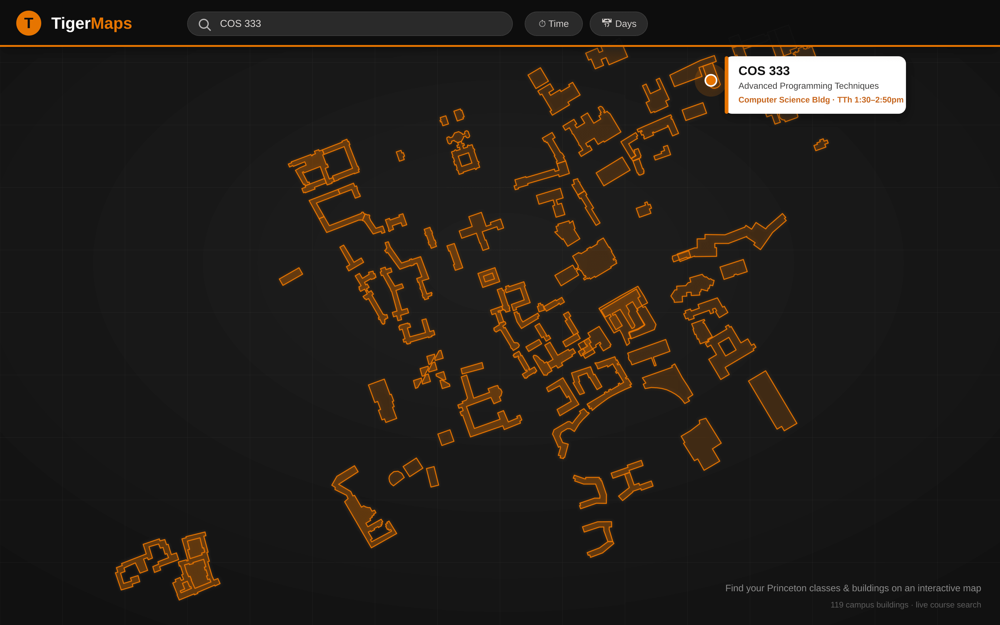

# TigerMaps

TigerMaps is a web application that gives Princeton students an easy way to find
the location of their classes, as well as other resources and places on campus.

Normally, finding where a class meets is a two-step process: look the course up on
the registrar, then look the building up on Google or the Princeton campus map.
TigerMaps bridges those steps into one. Students can search for courses and
buildings from a single search bar, refine the results with day/time filters, and
jump straight to the location on an interactive campus map with a popup of details.

It also surfaces other campus resources — dining halls, kitchens, laundry rooms,
printers, water fountains, and study hotspots.



> TigerMaps is a fork of [ClassMaps](https://github.com/DavidTodd26/ClassMaps),
> updated to run on a modern Django stack and deploy on [Render](https://render.com).

## Tech stack

- **Backend:** Django 4.2 (Python 3.11)
- **Database:** PostgreSQL in production, SQLite for local development
- **Auth:** Princeton CAS (`django-cas-ng`) in production; Django's built-in auth locally
- **Frontend:** Leaflet map with vanilla JS, jQuery, and Bootstrap
- **Static files:** WhiteNoise
- **Hosting:** Render (`render.yaml` + `build.sh`)

## Local development

Local development uses SQLite and Django's built-in login (no Princeton CAS or
PostgreSQL required). The settings module `classmaps.settings_local` wires this up.

```bash
# 1. Install dependencies (a virtualenv is recommended)
pip install -r requirements.txt

# 2. Apply migrations (creates db.sqlite3)
python manage.py migrate --settings=classmaps.settings_local

# 3. Seed real Princeton building/course data so the map has content
python manage.py seed_demo --settings=classmaps.settings_local

# 4. Run the development server
python manage.py runserver --settings=classmaps.settings_local

# 5. (optional) Create an account to test saving favorites
python manage.py createsuperuser --settings=classmaps.settings_local
```

Then visit http://127.0.0.1:8000/ — the map is a **public demo**, so you can
explore and search right away. Logging in (step 5) is only needed to save
favorites.

To avoid repeating `--settings` on every command, you can export it for the session:

```bash
export DJANGO_SETTINGS_MODULE=classmaps.settings_local
```

`seed_demo` reads the scraped JSON in `scraping/` (≈300 buildings and the
current course offerings) and is idempotent — it is a no-op once data exists,
so it is safe to re-run. Pass `--force` to wipe and reseed. To refresh the
underlying data from the registrar, see [Updating the data](#updating-the-data).

## Running the tests

```bash
python manage.py test classes --settings=classmaps.settings_local
```

The suite covers the model layer (including the custom `JSONArrayField`), the
search/day/time query logic, and the authenticated save/search views.

## Deployment (Render)

Deployment is configured by [`render.yaml`](render.yaml) (a managed PostgreSQL
database plus a Python web service) and [`build.sh`](build.sh), which installs
dependencies, collects static files, and runs migrations.

Environment variables read by `classmaps/settings.py`:

| Variable                  | Purpose                                                        |
| ------------------------- | -------------------------------------------------------------- |
| `DATABASE_URL`            | PostgreSQL connection string (provided by Render)              |
| `SECRET_KEY`              | Django secret key (generated by Render)                        |
| `DEBUG`                   | `True`/`False`; defaults to `False`                            |
| `RENDER_EXTERNAL_HOSTNAME`| Added to `ALLOWED_HOSTS` automatically on Render               |
| `ALLOWED_HOSTS`           | Extra comma-separated hosts to allow                           |
| `CAS_REDIRECT_URL`        | Where to send users after CAS login (defaults to `/`)          |
| `LOGIN_URL`               | Login URL (defaults to `/accounts/login`)                      |
| `CSRF_TRUSTED_ORIGINS`    | Extra comma-separated HTTPS origins to trust for form POSTs    |

`build.sh` also runs `seed_demo`, so the database is populated automatically on
the first deploy.

### Access model

The map, search, and building/course details are **public** — anyone can
explore the demo without logging in. Logging in with **Princeton CAS** is only
required to save favorites, and the "Log in with Princeton" button is wired up
for that. Note that CAS only works once Princeton OIT has registered the
deployment's URL as an authorized service; until then the public demo is fully
usable on its own.

## Updating the data

Course and building data is scraped from the Princeton registrar and campus
web feeds. The scripts and a full walkthrough live in
[`scraping/README.md`](scraping/README.md).

## Project structure

```
classmaps/        Django project (settings, URLs, WSGI)
  settings.py        production settings (PostgreSQL + CAS)
  settings_local.py  local development settings (SQLite + built-in auth)
classes/          the main Django app
  models.py          Building, Section, and User models
  views.py           search, save/remove, and JSON API views
  tests.py           test suite
  static/, templates/  frontend assets and pages
scraping/         data-scraping scripts and source JSON
```
